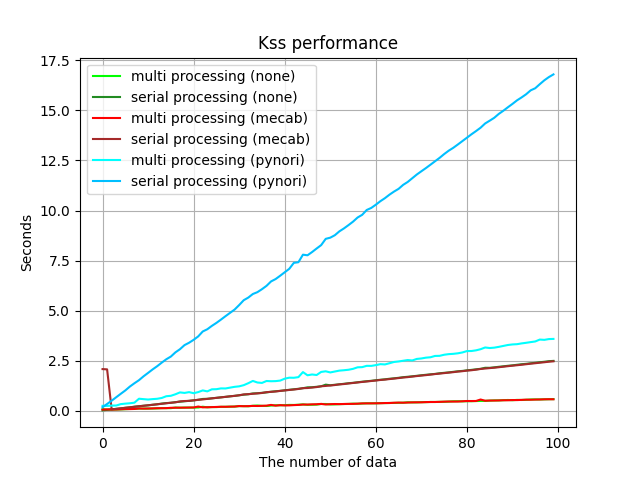

# Performance Analysis

## 1. Segmentation Error Rate
The following table indicates how often toolkits lead to mis-segmentation. I collected 377 Korean sentences that are difficult to segment and evaluated the error rate based on this data (`/tests/test_uoneway.txt`). 
Since each line of data consists of a complete sentence, it shouldn't be segmented, but segmentation toolkits often make mistakes. the following table shows how often each toolkit makes mis-segmentation as a percentage. Note this is just an error rate, not an accuracy. (Even if you don't segment at all, you can get an error rate of 0.000%)

### 1.1. Open-ended segmentation

Open-ended segmentation is the setting that can segment even parts without punctuation. This setting is much more difficult than the punctuation-only segmentation setting because the segmentation is allowed everywhere of input text even if there are no punctuation. 
Unfortunately, among the existing Korean sentence segmentation library, Kss is the only one that supports this setting. Therefore, I compared the performance with previous versions of Kss.

|Backend                        |Error rate|
|:------------------------------|:--------:|
|Kss 3.0 (Mecab backend)        |1.3262%   |
|Kss 3.0 (Pynori backend)       |2.3872%   |
|Kss 2.5.1 (`safe`=`False`)     |9.0476%   |
|Kss 1.3.1 (C++ version)        |60.3174%  |

This result shows that more accurate and safe sentence segmentation is possible by using morpheme features. 
As shown in the table, the error rate is reduced than Non-morpheme backend.

- Comparison with Punctuation-only segmentation toolkits

You can check the result of Punctuation-only segmentation in the next section. Surprisingly, Kss 3.0 has a similar error rate than Punctuation-only segmentation toolkits (e.g. OKT, Hannanum). 
This means that Kss 3.0 is a toolkit that can segment everywhere in the input text, but is safer than existing Punctuation-only segmentation toolkit which have limited their own performance for segmentation safety. If you want to reproduce this, run `/tests/eval_open_ended.py`.

### 1.2. Punctuation-only segmentation

Punctuation-only segmentation is a setting that segments sentences only in parts with punctuation. 
Existing Korean sentence segmentation toolkits (OKT, Hannanum, etc.) work with this setting. 
Kss also supports this setting using the option named `use_heuristic`.

|Backend                        |Error rate|
|:------------------------------|:--------:|
|Kss 3.0 (Mecab backend)        |0.0000%   |
|Kss 3.0 (Pynori backend)       |0.0000%   |
|Kss 2.5.1 (`safe`=`True`)      |2.3809%   |
|OKT 2.1.3 (powered by KoalaNLP)|4.2440%   |
|Hannanum (powered by KoalaNLP) |4.5092%   |

Surprisingly, Kss 3.0 (morpheme backend) never made any mistake on our test dataset. 
If so, someone may ask if the Punctuation-only setting in Kss 3.0 isn't working very well. 
Unfortunately, we have not yet built a dataset to measure this. 
Therefore, we present the qualitative evaluation results in the next section.
If you want to reproduce this, run `/tests/eval_punct_only.py`.

## 2. Qualitative Analysis
Segmentation Error Rate is an indicator that measures how few mistakes are made. 
How good at segmentation can be checked in a qualitative evaluation. 
The article used in sentence segmentation is referenced [here](http://semantics.kr/%ED%95%9C%EA%B5%AD%EC%96%B4-%ED%98%95%ED%83%9C%EC%86%8C-%EB%B6%84%EC%84%9D%EA%B8%B0-%EB%B3%84-%EB%AC%B8%EC%9E%A5-%EB%B6%84%EB%A6%AC-%EC%84%B1%EB%8A%A5%EB%B9%84%EA%B5%90/).

> 강남역 맛집으로 소문난 강남 토끼정에 다녀왔습니다. 회사 동료 분들과 다녀왔는데 분위기도 좋고 음식도 맛있었어요 다만, 강남 토끼정이 강남 쉑쉑버거 골목길로 쭉 올라가야 하는데 다들 쉑쉑버거의 유혹에 넘어갈 뻔 했답니다 강남역 맛집 토끼정의 외부 모습. 강남 토끼정은 4층 건물 독채로 이루어져 있습니다. 역시 토끼정 본 점 답죠?ㅎㅅㅎ 건물은 크지만 간판이 없기 때문에 지나칠 수 있으니 조심하세요 강남 토끼정의 내부 인테리어. 평일 저녁이었지만 강남역 맛집 답게 사람들이 많았어요. 전체적으로 편안하고 아늑한 공간으로 꾸며져 있었습니다ㅎㅎ 한 가지 아쉬웠던 건 조명이 너무 어두워 눈이 침침했던… 저희는 3층에 자리를 잡고 음식을 주문했습니다. 총 5명이서 먹고 싶은 음식 하나씩 골라 다양하게 주문했어요 첫 번째 준비된 메뉴는 토끼정 고로케와 깻잎 불고기 사라다를 듬뿍 올려 먹는 맛있는 밥입니다. 여러가지 메뉴를 한 번에 시키면 준비되는 메뉴부터 가져다 주더라구요. 토끼정 고로케 금방 튀겨져 나와 겉은 바삭하고 속은 촉촉해 맛있었어요! 깻잎 불고기 사라다는 불고기, 양배추, 버섯을 볶아 깻잎을 듬뿍 올리고 우엉 튀김을 곁들여 밥이랑 함께 먹는 메뉴입니다. 사실 전 고기를 안 먹어서 무슨 맛인지 모르겠지만.. 다들 엄청 잘 드셨습니다ㅋㅋ 이건 제가 시킨 촉촉한 고로케와 크림스튜우동. 강남 토끼정에서 먹은 음식 중에 이게 제일 맛있었어요!!! 크림소스를 원래 좋아하기도 하지만, 느끼하지 않게 부드럽고 달달한 스튜와 쫄깃한 우동면이 너무 잘 어울려 계속 손이 가더라구요. 사진을 보니 또 먹고 싶습니다 간사이 풍 연어 지라시입니다. 일본 간사이 지방에서 많이 먹는 떠먹는 초밥(지라시스시)이라고 하네요. 밑에 와사비 마요밥 위에 연어들이 담겨져 있어 코끝이 찡할 수 있다고 적혀 있는데, 난 와사비 맛 1도 모르겠던데…? 와사비를 안 좋아하는 저는 불행인지 다행인지 연어 지라시를 매우 맛있게 먹었습니다ㅋㅋㅋ 다음 메뉴는 달짝지근한 숯불 갈비 덮밥입니다! 간장 양념에 구운 숯불 갈비에 양파, 깻잎, 달걀 반숙을 터트려 비벼 먹으면 그 맛이 크.. (물론 전 안 먹었지만…다른 분들이 그렇다고 하더라구요ㅋㅋㅋㅋㅋㅋㅋ) 마지막 메인 메뉴 양송이 크림수프와 숯불떡갈비 밥입니다. 크림리조또를 베이스로 위에 그루통과 숯불로 구운 떡갈비가 올라가 있어요! 크림스튜 우동 만큼이나 대박 맛있습니다…ㅠㅠㅠㅠㅠㅠ (크림 소스면 다 좋아하는 거 절대 아닙니다ㅋㅋㅋㅋㅋㅋ) 강남 토끼정 요리는 다 맛있지만 크림소스 요리를 참 잘하는 거 같네요 요건 물만 마시기 아쉬워 시킨 뉴자몽과 밀키소다 딸기통통! 유자와 자몽의 맛을 함께 느낄 수 있는 뉴자몽은 상큼함 그 자체였어요. 하치만 저는 딸기통통 밀키소다가 더 맛있었습니다ㅎㅎ 밀키소다는 토끼정에서만 만나볼 수 있는 메뉴라고 하니 한 번 드셔보시길 추천할게요!! 강남 토끼정은 강남역 맛집답게 모든 음식들이 대체적으로 맛있었어요! 건물 위치도 강남 대로변에서 조금 떨어져 있어 내부 인테리어처럼 아늑한 느낌도 있었구요ㅎㅎ 기회가 되면 다들 꼭 들러보세요~ 🙂

### 2.1. Open-ended segmentation

<details>
    <summary>Kss 3.0 (Mecab backend)</summary>

```
강남역 맛집으로 소문난 강남 토끼정에 다녀왔습니다.
회사 동료 분들과 다녀왔는데 분위기도 좋고 음식도 맛있었어요
다만, 강남 토끼정이 강남 쉑쉑버거 골목길로 쭉 올라가야 하는데 다들 쉑쉑버거의 유혹에 넘어갈 뻔 했답니다 강남역 맛집 토끼정의 외부 모습. 강남 토끼정은 4층 건물 독채로 이루어져 있습니다.
역시 토끼정 본 점 답죠?ㅎㅅㅎ
건물은 크지만 간판이 없기 때문에 지나칠 수 있으니 조심하세요
강남 토끼정의 내부 인테리어. 평일 저녁이었지만 강남역 맛집 답게 사람들이 많았어요.
전체적으로 편안하고 아늑한 공간으로 꾸며져 있었습니다ㅎㅎ
한 가지 아쉬웠던 건 조명이 너무 어두워 눈이 침침했던… 저희는 3층에 자리를 잡고 음식을 주문했습니다.
총 5명이서 먹고 싶은 음식 하나씩 골라 다양하게 주문했어요
첫 번째 준비된 메뉴는 토끼정 고로케와 깻잎 불고기 사라다를 듬뿍 올려 먹는 맛있는 밥입니다.
여러가지 메뉴를 한 번에 시키면 준비되는 메뉴부터 가져다 주더라구요.
토끼정 고로케 금방 튀겨져 나와 겉은 바삭하고 속은 촉촉해 맛있었어요!
깻잎 불고기 사라다는 불고기, 양배추, 버섯을 볶아 깻잎을 듬뿍 올리고 우엉 튀김을 곁들여 밥이랑 함께 먹는 메뉴입니다.
사실 전 고기를 안 먹어서 무슨 맛인지 모르겠지만.. 다들 엄청 잘 드셨습니다ㅋㅋ
이건 제가 시킨 촉촉한 고로케와 크림스튜우동. 강남 토끼정에서 먹은 음식 중에 이게 제일 맛있었어요!!!
크림소스를 원래 좋아하기도 하지만, 느끼하지 않게 부드럽고 달달한 스튜와 쫄깃한 우동면이 너무 잘 어울려 계속 손이 가더라구요.
사진을 보니 또 먹고 싶습니다
간사이 풍 연어 지라시입니다.
일본 간사이 지방에서 많이 먹는 떠먹는 초밥(지라시스시)이라고 하네요.
밑에 와사비 마요밥 위에 연어들이 담겨져 있어 코끝이 찡할 수 있다고 적혀 있는데, 난 와사비 맛 1도 모르겠던데…? 와사비를 안 좋아하는 저는 불행인지 다행인지 연어 지라시를 매우 맛있게 먹었습니다ㅋㅋㅋ
다음 메뉴는 달짝지근한 숯불 갈비 덮밥입니다!
간장 양념에 구운 숯불 갈비에 양파, 깻잎, 달걀 반숙을 터트려 비벼 먹으면 그 맛이 크.. (물론 전 안 먹었지만…다른 분들이 그렇다고 하더라구요ㅋㅋㅋㅋㅋㅋㅋ) 마지막 메인 메뉴 양송이 크림수프와 숯불떡갈비 밥입니다.
크림리조또를 베이스로 위에 그루통과 숯불로 구운 떡갈비가 올라가 있어요!
크림스튜 우동 만큼이나 대박 맛있습니다…ㅠㅠㅠㅠㅠㅠ (크림 소스면 다 좋아하는 거 절대 아닙니다ㅋㅋㅋㅋㅋㅋ) 강남 토끼정 요리는 다 맛있지만 크림소스 요리를 참 잘하는 거 같네요
요건 물만 마시기 아쉬워 시킨 뉴자몽과 밀키소다 딸기통통! 유자와 자몽의 맛을 함께 느낄 수 있는 뉴자몽은 상큼함 그 자체였어요.
하치만 저는 딸기통통 밀키소다가 더 맛있었습니다ㅎㅎ
밀키소다는 토끼정에서만 만나볼 수 있는 메뉴라고 하니 한 번 드셔보시길 추천할게요!!
강남 토끼정은 강남역 맛집답게 모든 음식들이 대체적으로 맛있었어요!
건물 위치도 강남 대로변에서 조금 떨어져 있어 내부 인테리어처럼 아늑한 느낌도 있었구요ㅎㅎ
기회가 되면 다들 꼭 들러보세요~
🙂
```

</details>

<details>
<summary>Kss 3.0 (Pynori backend)</summary>

```
강남역 맛집으로 소문난 강남 토끼정에 다녀왔습니다.
회사 동료 분들과 다녀왔는데 분위기도 좋고 음식도 맛있었어요
다만, 강남 토끼정이 강남 쉑쉑버거 골목길로 쭉 올라가야 하는데 다들 쉑쉑버거의 유혹에 넘어갈 뻔 했답니다 강남역 맛집 토끼정의 외부 모습. 강남 토끼정은 4층 건물 독채로 이루어져 있습니다.
역시 토끼정 본 점 답죠?ㅎㅅㅎ
건물은 크지만 간판이 없기 때문에 지나칠 수 있으니 조심하세요
강남 토끼정의 내부 인테리어.
평일 저녁이었지만 강남역 맛집 답게 사람들이 많았어요.
전체적으로 편안하고 아늑한 공간으로 꾸며져 있었습니다ㅎㅎ
한 가지 아쉬웠던 건 조명이 너무 어두워 눈이 침침했던… 저희는 3층에 자리를 잡고 음식을 주문했습니다.
총 5명이서 먹고 싶은 음식 하나씩 골라 다양하게 주문했어요
첫 번째 준비된 메뉴는 토끼정 고로케와 깻잎 불고기 사라다를 듬뿍 올려 먹는 맛있는 밥입니다.
여러가지 메뉴를 한 번에 시키면 준비되는 메뉴부터 가져다 주더라구요.
토끼정 고로케 금방 튀겨져 나와 겉은 바삭하고 속은 촉촉해 맛있었어요!
깻잎 불고기 사라다는 불고기, 양배추, 버섯을 볶아 깻잎을 듬뿍 올리고 우엉 튀김을 곁들여 밥이랑 함께 먹는 메뉴입니다.
사실 전 고기를 안 먹어서 무슨 맛인지 모르겠지만.. 다들 엄청 잘 드셨습니다ㅋㅋ
이건 제가 시킨 촉촉한 고로케와 크림스튜우동. 강남 토끼정에서 먹은 음식 중에 이게 제일 맛있었어요!!!
크림소스를 원래 좋아하기도 하지만, 느끼하지 않게 부드럽고 달달한 스튜와 쫄깃한 우동면이 너무 잘 어울려 계속 손이 가더라구요.
사진을 보니 또 먹고 싶습니다
간사이 풍 연어 지라시입니다.
일본 간사이 지방에서 많이 먹는 떠먹는 초밥(지라시스시)이라고 하네요.
밑에 와사비 마요밥 위에 연어들이 담겨져 있어 코끝이 찡할 수 있다고 적혀 있는데, 난 와사비 맛 1도 모르겠던데…? 와사비를 안 좋아하는 저는 불행인지 다행인지 연어 지라시를 매우 맛있게 먹었습니다ㅋㅋㅋ
다음 메뉴는 달짝지근한 숯불 갈비 덮밥입니다!
간장 양념에 구운 숯불 갈비에 양파, 깻잎, 달걀 반숙을 터트려 비벼 먹으면 그 맛이 크.. (물론 전 안 먹었지만…다른 분들이 그렇다고 하더라구요ㅋㅋㅋㅋㅋㅋㅋ) 마지막 메인 메뉴 양송이 크림수프와 숯불떡갈비 밥입니다.
크림리조또를 베이스로 위에 그루통과 숯불로 구운 떡갈비가 올라가 있어요!
크림스튜 우동 만큼이나 대박 맛있습니다…ㅠㅠㅠㅠㅠㅠ (크림 소스면 다 좋아하는 거 절대 아닙니다ㅋㅋㅋㅋㅋㅋ) 강남 토끼정 요리는 다 맛있지만 크림소스 요리를 참 잘하는 거 같네요
요건 물만 마시기 아쉬워 시킨 뉴자몽과 밀키소다 딸기통통! 유자와 자몽의 맛을 함께 느낄 수 있는 뉴자몽은 상큼함 그 자체였어요.
하치만 저는 딸기통통 밀키소다가 더 맛있었습니다ㅎㅎ
밀키소다는 토끼정에서만 만나볼 수 있는 메뉴라고 하니 한 번 드셔보시길 추천할게요!!
강남 토끼정은 강남역 맛집답게 모든 음식들이 대체적으로 맛있었어요!
건물 위치도 강남 대로변에서 조금 떨어져 있어 내부 인테리어처럼 아늑한 느낌도 있었구요ㅎㅎ
기회가 되면 다들 꼭 들러보세요~
🙂
```

</details>

### 2.2. Punctuation-only segmentation

<details>
<summary>Kss 3.0 (Mecab backend)</summary>

```
강남역 맛집으로 소문난 강남 토끼정에 다녀왔습니다.
회사 동료 분들과 다녀왔는데 분위기도 좋고 음식도 맛있었어요 다만, 강남 토끼정이 강남 쉑쉑버거 골목길로 쭉 올라가야 하는데 다들 쉑쉑버거의 유혹에 넘어갈 뻔 했답니다 강남역 맛집 토끼정의 외부 모습. 강남 토끼정은 4층 건물 독채로 이루어져 있습니다.
역시 토끼정 본 점 답죠?ㅎㅅㅎ
건물은 크지만 간판이 없기 때문에 지나칠 수 있으니 조심하세요 강남 토끼정의 내부 인테리어. 평일 저녁이었지만 강남역 맛집 답게 사람들이 많았어요.
전체적으로 편안하고 아늑한 공간으로 꾸며져 있었습니다ㅎㅎ 한 가지 아쉬웠던 건 조명이 너무 어두워 눈이 침침했던… 저희는 3층에 자리를 잡고 음식을 주문했습니다.
총 5명이서 먹고 싶은 음식 하나씩 골라 다양하게 주문했어요 첫 번째 준비된 메뉴는 토끼정 고로케와 깻잎 불고기 사라다를 듬뿍 올려 먹는 맛있는 밥입니다.
여러가지 메뉴를 한 번에 시키면 준비되는 메뉴부터 가져다 주더라구요.
토끼정 고로케 금방 튀겨져 나와 겉은 바삭하고 속은 촉촉해 맛있었어요!
깻잎 불고기 사라다는 불고기, 양배추, 버섯을 볶아 깻잎을 듬뿍 올리고 우엉 튀김을 곁들여 밥이랑 함께 먹는 메뉴입니다.
사실 전 고기를 안 먹어서 무슨 맛인지 모르겠지만.. 다들 엄청 잘 드셨습니다ㅋㅋ 이건 제가 시킨 촉촉한 고로케와 크림스튜우동. 강남 토끼정에서 먹은 음식 중에 이게 제일 맛있었어요!!!
크림소스를 원래 좋아하기도 하지만, 느끼하지 않게 부드럽고 달달한 스튜와 쫄깃한 우동면이 너무 잘 어울려 계속 손이 가더라구요.
사진을 보니 또 먹고 싶습니다 간사이 풍 연어 지라시입니다.
일본 간사이 지방에서 많이 먹는 떠먹는 초밥(지라시스시)이라고 하네요.
밑에 와사비 마요밥 위에 연어들이 담겨져 있어 코끝이 찡할 수 있다고 적혀 있는데, 난 와사비 맛 1도 모르겠던데…? 와사비를 안 좋아하는 저는 불행인지 다행인지 연어 지라시를 매우 맛있게 먹었습니다ㅋㅋㅋ 다음 메뉴는 달짝지근한 숯불 갈비 덮밥입니다!
간장 양념에 구운 숯불 갈비에 양파, 깻잎, 달걀 반숙을 터트려 비벼 먹으면 그 맛이 크.. (물론 전 안 먹었지만…다른 분들이 그렇다고 하더라구요ㅋㅋㅋㅋㅋㅋㅋ) 마지막 메인 메뉴 양송이 크림수프와 숯불떡갈비 밥입니다.
크림리조또를 베이스로 위에 그루통과 숯불로 구운 떡갈비가 올라가 있어요!
크림스튜 우동 만큼이나 대박 맛있습니다…ㅠㅠㅠㅠㅠㅠ (크림 소스면 다 좋아하는 거 절대 아닙니다ㅋㅋㅋㅋㅋㅋ) 강남 토끼정 요리는 다 맛있지만 크림소스 요리를 참 잘하는 거 같네요 요건 물만 마시기 아쉬워 시킨 뉴자몽과 밀키소다 딸기통통! 유자와 자몽의 맛을 함께 느낄 수 있는 뉴자몽은 상큼함 그 자체였어요.
하치만 저는 딸기통통 밀키소다가 더 맛있었습니다ㅎㅎ 밀키소다는 토끼정에서만 만나볼 수 있는 메뉴라고 하니 한 번 드셔보시길 추천할게요!!
강남 토끼정은 강남역 맛집답게 모든 음식들이 대체적으로 맛있었어요!
건물 위치도 강남 대로변에서 조금 떨어져 있어 내부 인테리어처럼 아늑한 느낌도 있었구요ㅎㅎ 기회가 되면 다들 꼭 들러보세요~
🙂
```

</details>

<details>
<summary>Kss 3.0 (Pynori backend)</summary>

```
강남역 맛집으로 소문난 강남 토끼정에 다녀왔습니다.
회사 동료 분들과 다녀왔는데 분위기도 좋고 음식도 맛있었어요 다만, 강남 토끼정이 강남 쉑쉑버거 골목길로 쭉 올라가야 하는데 다들 쉑쉑버거의 유혹에 넘어갈 뻔 했답니다 강남역 맛집 토끼정의 외부 모습. 강남 토끼정은 4층 건물 독채로 이루어져 있습니다.
역시 토끼정 본 점 답죠?ㅎㅅㅎ
건물은 크지만 간판이 없기 때문에 지나칠 수 있으니 조심하세요 강남 토끼정의 내부 인테리어.
평일 저녁이었지만 강남역 맛집 답게 사람들이 많았어요.
전체적으로 편안하고 아늑한 공간으로 꾸며져 있었습니다ㅎㅎ 한 가지 아쉬웠던 건 조명이 너무 어두워 눈이 침침했던… 저희는 3층에 자리를 잡고 음식을 주문했습니다.
총 5명이서 먹고 싶은 음식 하나씩 골라 다양하게 주문했어요 첫 번째 준비된 메뉴는 토끼정 고로케와 깻잎 불고기 사라다를 듬뿍 올려 먹는 맛있는 밥입니다.
여러가지 메뉴를 한 번에 시키면 준비되는 메뉴부터 가져다 주더라구요.
토끼정 고로케 금방 튀겨져 나와 겉은 바삭하고 속은 촉촉해 맛있었어요!
깻잎 불고기 사라다는 불고기, 양배추, 버섯을 볶아 깻잎을 듬뿍 올리고 우엉 튀김을 곁들여 밥이랑 함께 먹는 메뉴입니다.
사실 전 고기를 안 먹어서 무슨 맛인지 모르겠지만.. 다들 엄청 잘 드셨습니다ㅋㅋ 이건 제가 시킨 촉촉한 고로케와 크림스튜우동. 강남 토끼정에서 먹은 음식 중에 이게 제일 맛있었어요!!!
크림소스를 원래 좋아하기도 하지만, 느끼하지 않게 부드럽고 달달한 스튜와 쫄깃한 우동면이 너무 잘 어울려 계속 손이 가더라구요.
사진을 보니 또 먹고 싶습니다 간사이 풍 연어 지라시입니다.
일본 간사이 지방에서 많이 먹는 떠먹는 초밥(지라시스시)이라고 하네요.
밑에 와사비 마요밥 위에 연어들이 담겨져 있어 코끝이 찡할 수 있다고 적혀 있는데, 난 와사비 맛 1도 모르겠던데…? 와사비를 안 좋아하는 저는 불행인지 다행인지 연어 지라시를 매우 맛있게 먹었습니다ㅋㅋㅋ 다음 메뉴는 달짝지근한 숯불 갈비 덮밥입니다!
간장 양념에 구운 숯불 갈비에 양파, 깻잎, 달걀 반숙을 터트려 비벼 먹으면 그 맛이 크.. (물론 전 안 먹었지만…다른 분들이 그렇다고 하더라구요ㅋㅋㅋㅋㅋㅋㅋ) 마지막 메인 메뉴 양송이 크림수프와 숯불떡갈비 밥입니다.
크림리조또를 베이스로 위에 그루통과 숯불로 구운 떡갈비가 올라가 있어요!
크림스튜 우동 만큼이나 대박 맛있습니다…ㅠㅠㅠㅠㅠㅠ (크림 소스면 다 좋아하는 거 절대 아닙니다ㅋㅋㅋㅋㅋㅋ) 강남 토끼정 요리는 다 맛있지만 크림소스 요리를 참 잘하는 거 같네요 요건 물만 마시기 아쉬워 시킨 뉴자몽과 밀키소다 딸기통통! 유자와 자몽의 맛을 함께 느낄 수 있는 뉴자몽은 상큼함 그 자체였어요.
하치만 저는 딸기통통 밀키소다가 더 맛있었습니다ㅎㅎ 밀키소다는 토끼정에서만 만나볼 수 있는 메뉴라고 하니 한 번 드셔보시길 추천할게요!!
강남 토끼정은 강남역 맛집답게 모든 음식들이 대체적으로 맛있었어요!
건물 위치도 강남 대로변에서 조금 떨어져 있어 내부 인테리어처럼 아늑한 느낌도 있었구요ㅎㅎ 기회가 되면 다들 꼭 들러보세요~
🙂
```

</details>

<details>
<summary>OKT 2.3.1</summary>

```
강남역 맛집으로 소문난 강남 토끼정에 다녀왔습니다.
회사 동료 분들과 다녀왔는데 분위기도 좋고 음식도 맛있었어요 다만, 강남 토끼정이 강남 쉑쉑버거 골목길로 쭉 올라가야 하는데 다들 쉑쉑버거의 유혹에 넘어갈 뻔 했답니다 강남역 맛집 토끼정의 외부 모습.
강남 토끼정은 4층 건물 독채로 이루어져 있습니다.
역시 토끼정 본 점 답죠?ㅎㅅㅎ 건물은 크지만 간판이 없기 때문에 지나칠 수 있으니 조심하세요 강남 토끼정의 내부 인테리어.
평일 저녁이었지만 강남역 맛집 답게 사람들이 많았어요.
전체적으로 편안하고 아늑한 공간으로 꾸며져 있었습니다ㅎㅎ 한 가지 아쉬웠던 건 조명이 너무 어두워 눈이 침침했던…
저희는 3층에 자리를 잡고 음식을 주문했습니다.
총 5명이서 먹고 싶은 음식 하나씩 골라 다양하게 주문했어요 첫 번째 준비된 메뉴는 토끼정 고로케와 깻잎 불고기 사라다를 듬뿍 올려 먹는 맛있는 밥입니다.
여러가지 메뉴를 한 번에 시키면 준비되는 메뉴부터 가져다 주더라구요.
토끼정 고로케 금방 튀겨져 나와 겉은 바삭하고 속은 촉촉해 맛있었어요!
깻잎 불고기 사라다는 불고기, 양배추, 버섯을 볶아 깻잎을 듬뿍 올리고 우엉 튀김을 곁들여 밥이랑 함께 먹는 메뉴입니다.
사실 전 고기를 안 먹어서 무슨 맛인지 모르겠지만..
다들 엄청 잘 드셨습니다ㅋㅋ 이건 제가 시킨 촉촉한 고로케와 크림스튜우동.	다들 엄청 잘 드셨습니다ㅋㅋ 이건 제가 시킨 촉촉한 고로케와 크림스튜우동 . 
이건 제가 시킨 촉촉한 고로케와 크림스튜우동.	 	
강남 토끼정에서 먹은 음식 중에 이게 제일 맛있었어요!!!
크림소스를 원래 좋아하기도 하지만, 느끼하지 않게 부드럽고 달달한 스튜와 쫄깃한 우동면이 너무 잘 어울려 계속 손이 가더라구요.
사진을 보니 또 먹고 싶습니다 간사이 풍 연어 지라시입니다.
일본 간사이 지방에서 많이 먹는 떠먹는 초밥(지라시스시)이라고 하네요.
밑에 와사비 마요밥 위에 연어들이 담겨져 있어 코끝이 찡할 수 있다고 적혀 있는데, 난 와사비 맛 1도 모르겠던데…?
와사비를 안 좋아하는 저는 불행인지 다행인지 연어 지라시를 매우 맛있게 먹었습니다ㅋㅋㅋ 다음 메뉴는 달짝지근한 숯불 갈비 덮밥입니다!
간장 양념에 구운 숯불 갈비에 양파, 깻잎, 달걀 반숙을 터트려 비벼 먹으면 그 맛이 크..
(물론 전 안 먹었지만…다른 분들이 그렇다고 하더라구요ㅋㅋㅋㅋㅋㅋㅋ) 마지막 메인 메뉴 양송이 크림수프와 숯불떡갈비 밥입니다.
크림리조또를 베이스로 위에 그루통과 숯불로 구운 떡갈비가 올라가 있어요!
크림스튜 우동 만큼이나 대박 맛있습니다…ㅠㅠㅠㅠㅠㅠ (크림 소스면 다 좋아하는 거 절대 아닙니다ㅋㅋㅋㅋㅋㅋ) 강남 토끼정 요리는 다 맛있지만 크림소스 요리를 참 잘하는 거 같네요 요건 물만 마시기 아쉬워 시킨 뉴자몽과 밀키소다 딸기통통!
유자와 자몽의 맛을 함께 느낄 수 있는 뉴자몽은 상큼함 그 자체였어요.
하치만 저는 딸기통통 밀키소다가 더 맛있었습니다ㅎㅎ 밀키소다는 토끼정에서만 만나볼 수 있는 메뉴라고 하니 한 번 드셔보시길 추천할게요!!
강남 토끼정은 강남역 맛집답게 모든 음식들이 대체적으로 맛있었어요!
건물 위치도 강남 대로변에서 조금 떨어져 있어 내부 인테리어처럼 아늑한 느낌도 있었구요ㅎㅎ 기회가 되면 다들 꼭 들러보세요~ 🙂
```

</details>

<details>
<summary>Hannanum</summary>

```
강남역 맛집으로 소문난 강남 토끼정에 다녀왔습니다 . 
회사 동료 분들과 다녀왔는데 분위기도 좋고 음식도 맛있었어요 다만, 강남 토끼정이 강남 쉑쉑버거 골목길로 쭉 올라가야 하는데 다들 쉑쉑버거의 유혹에 넘어갈 뻔 했답니다 강남역 맛집 토끼정의 외부 모습 . 
강남 토끼정은 4층 건물 독채로 이루어져 있습니다 . 
역시 토끼정 본 점 답죠 ? 
ㅎㅅㅎ 건물은 크지만 간판이 없기 때문에 지나칠 수 있으니 조심하세요 강남 토끼정의 내부 인테리어 . 
평일 저녁이었지만 강남역 맛집 답게 사람들이 많았어요 . 
전체적으로 편안하고 아늑한 공간으로 꾸며져 있었습니다ㅎㅎ 한 가지 아쉬웠던 건 조명이 너무 어두워 눈이 침침했던 … 
저희는 3층에 자리를 잡고 음식을 주문했습니다 . 
총 5명이서 먹고 싶은 음식 하나씩 골라 다양하게 주문했어요 첫 번째 준비된 메뉴는 토끼정 고로케와 깻잎 불고기 사라다를 듬뿍 올려 먹는 맛있는 밥입니다 . 
여러가지 메뉴를 한 번에 시키면 준비되는 메뉴부터 가져다 주더라구요 . 
토끼정 고로케 금방 튀겨져 나와 겉은 바삭하고 속은 촉촉해 맛있었어요 ! 
깻잎 불고기 사라다는 불고기, 양배추, 버섯을 볶아 깻잎을 듬뿍 올리고 우엉 튀김을 곁들여 밥이랑 함께 먹는 메뉴입니다 . 
사실 전 고기를 안 먹어서 무슨 맛인지 모르겠지만 .. 
다들 엄청 잘 드셨습니다ㅋㅋ 이건 제가 시킨 촉촉한 고로케와 크림스튜우동 . 
강남 토끼정에서 먹은 음식 중에 이게 제일 맛있었어요 !!! 
크림소스를 원래 좋아하기도 하지만, 느끼하지 않게 부드럽고 달달한 스튜와 쫄깃한 우동면이 너무 잘 어울려 계속 손이 가더라구요 .
사진을 보니 또 먹고 싶습니다 간사이 풍 연어 지라시입니다 . 
일본 간사이 지방에서 많이 먹는 떠먹는 초밥(지라시스시)이라고 하네요 . 
밑에 와사비 마요밥 위에 연어들이 담겨져 있어 코끝이 찡할 수 있다고 적혀 있는데, 난 와사비 맛 1도 모르겠던데 …? 
와사비를 안 좋아하는 저는 불행인지 다행인지 연어 지라시를 매우 맛있게 먹었습니다ㅋㅋㅋ 다음 메뉴는 달짝지근한 숯불 갈비 덮밥입니다 ! 
간장 양념에 구운 숯불 갈비에 양파, 깻잎, 달걀 반숙을 터트려 비벼 먹으면 그 맛이 크. . 
(물론 전 안 먹었지만 … 
다른 분들이 그렇다고 하더라구요ㅋㅋㅋㅋㅋㅋㅋ) 마지막 메인 메뉴 양송이 크림수프와 숯불떡갈비 밥입니다 . 
크림리조또를 베이스로 위에 그루통과 숯불로 구운 떡갈비가 올라가 있어요 ! 
크림스튜 우동 만큼이나 대박 맛있습니다 … 
ㅠㅠㅠㅠㅠㅠ (크림 소스면 다 좋아하는 거 절대 아닙니다ㅋㅋㅋㅋㅋㅋ) 강남 토끼정 요리는 다 맛있지만 크림소스 요리를 참 잘하는 거 같네요 요건 물만 마시기 아쉬워 시킨 뉴자몽과 밀키소다 딸기통통 ! 
유자와 자몽의 맛을 함께 느낄 수 있는 뉴자몽은 상큼함 그 자체였어요 .
하치만 저는 딸기통통 밀키소다가 더 맛있었습니다ㅎㅎ 밀키소다는 토끼정에서만 만나볼 수 있는 메뉴라고 하니 한 번 드셔보시길 추천할게요 !! 
강남 토끼정은 강남역 맛집답게 모든 음식들이 대체적으로 맛있었어요 ! 
건물 위치도 강남 대로변에서 조금 떨어져 있어 내부 인테리어처럼 아늑한 느낌도 있었구요ㅎㅎ 기회가 되면 다들 꼭 들러보세요~ 🙂 
```

</details>

## 3. Segmentation Speed Analysis
I also compared the speed with a combination of morpheme backend and multiprocessing. For the experiment, I used Macbook M1 silicon (8 processes).
If you use different CPUs and number of cores, there may be a difference in the results.



|Backend             |Multiprocessing | 5 sample  | 10 samples | 50 samples | 100 samples|
|:-------------------|:--------------:|:---------:|:----------:|:----------:|:----------:|
|Non-morpheme backend|Yes             |0.07581 sec|0.10828 sec |0.33892 sec |0.58824 sec |
|Non-morpheme backend|No              |0.12730 sec|0.25130 sec |1.24873 sec |2.49617 sec |
|Mecab backend       |Yes             |0.07623 sec|0.11040 sec |0.33486 sec |0.58013 sec |
|Mecab backend       |No              |0.12231 sec|0.25161 sec |1.24385 sec |2.47525 sec |
|Pynori backend      |Yes             |0.33854 sec|0.53759 sec |2.03244 sec |3.59298 sec |
|Pynori backend      |No              |0.85390 sec|1.72044 sec |8.56288 sec |16.79657 sec|

Experimental results have shown that using the multiprocessing is the most efficient. With multiprocessing, you can get a huge performance boost because you can process multiple input data at the same time.
I also found the [Pynori](https://github.com/gritmind/python-nori) backend to be very slow. However, it can be supplemented if multiprocessing is used together.
Meanwhile, [Mecab](https://github.com/jonghwanhyeon/python-mecab-ko) has similar speed with non-morpheme backend (backend that is not using morpheme analyzer).
Therefore, If you want to achieve both high speed and performance, it is best to use a combination of mecab and multiprocessing.
If you want to reproduce this, run `/tests/eval_speed.py`.

P.s. The reason mecab's graph bounces at the beginning is because it includes the time to load the dictionary. (because it is loaded lazy on first execution)
